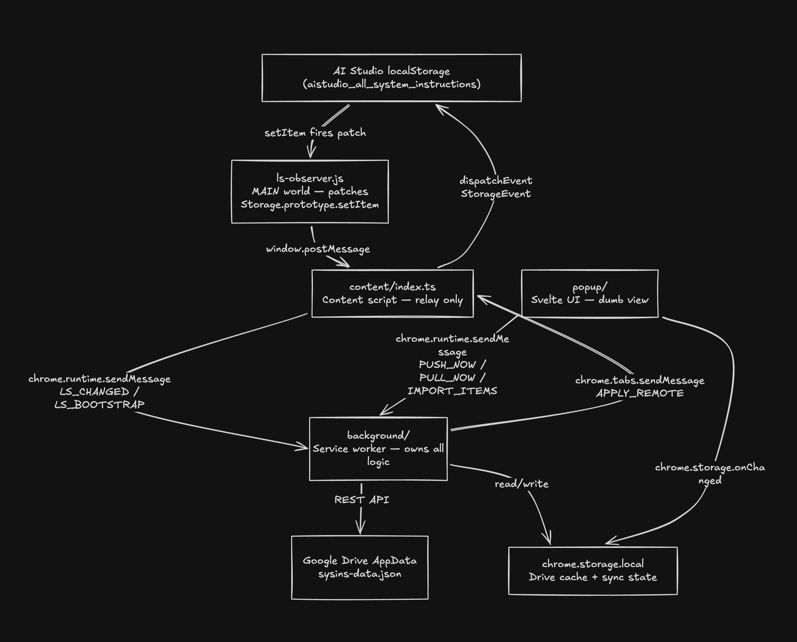
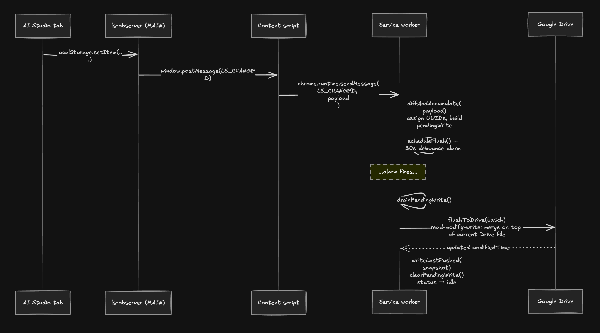
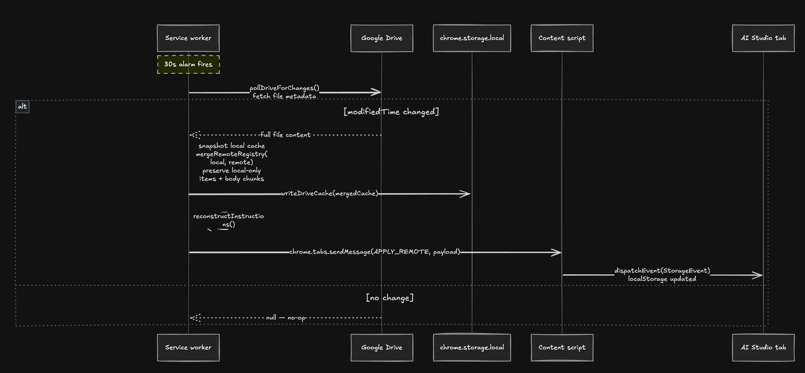
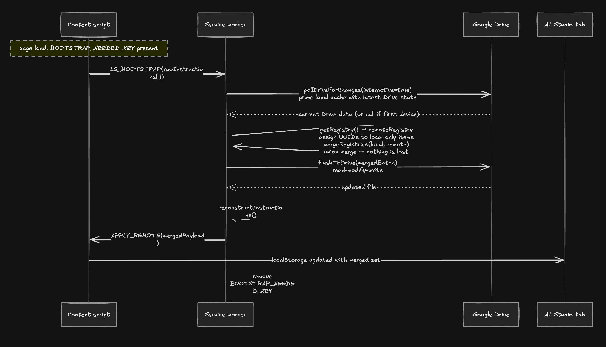

# AI Studio Instructions Sync

A Chrome extension that syncs your [Google AI Studio](https://aistudio.google.com) system instructions across every device where you're signed into Chrome — automatically, with no custom server.

AI Studio stores saved system instructions in `localStorage`, which is per-device and per-browser-profile only. This extension lifts that data into your **Google Drive AppData folder** so your entire library follows you wherever your Google account goes.

## Why This Exists

If you use AI Studio on multiple machines, you know the frustration: prompts you crafted on your laptop aren't on your desktop, and vice versa. Chrome sync handles bookmarks and passwords automatically — your system instructions should be no different.

**Why Google Drive AppData instead of `chrome.storage.sync`?**

`chrome.storage.sync` looks like the obvious choice but has a critical limitation: Chrome only syncs extension storage for extensions installed from the Chrome Web Store. Sideloaded (developer-mode) extensions get a random ID per device, so their sync namespaces never overlap — data siloes instead of syncing, even with the same Google account.

Drive AppData is the extension's private storage folder in the user's own Google Drive. It is hidden from the Drive UI, works identically for sideloaded and Web Store installs, and your data never leaves your own Google account.

## Features

- **Automatic bidirectional sync** — edits propagate across devices within ~30 seconds
- **Non-destructive merges** — per-instruction UUIDs, last-write-wins timestamps, soft-delete tombstones
- **First-install union merge** — installing on a new machine merges both sides; nothing is lost
- **Single OAuth consent** — uses your existing Chrome sign-in; one consent screen, then silent forever
- **Toolbar popup** — sync status, instruction count, manual Push Now / Pull Now buttons
- **JSON export / import** — full backup and restore from a single file
- **Zero infrastructure** — no backend server, no telemetry, no third-party calls; Drive is the only backend

## Prerequisites

- Chrome 116+ (or any Chromium browser with `chrome.identity` support)
- A Google account signed into Chrome
- Node.js 18+ and npm (for building from source)

## Install

```bash
git clone https://github.com/AhsanAyaz/aistudio-instructions-sync.git
cd aistudio-instructions-sync
npm install
npm run build
```

Then in Chrome:

1. Open `chrome://extensions`
2. Enable **Developer mode** (top-right toggle)
3. Click **Load unpacked**
4. Select the `.output/chrome-mv3/` directory

Repeat on every device. The extension ID is pinned via a manifest `key` field so it is identical across devices.

## First Use

Open AI Studio on any device. The extension detects your existing instructions and uploads them to Drive (a one-time bootstrap). On your other devices, the next 30-second poll picks up those instructions and delivers them to the tab.

**The first Push Now or Pull Now triggers a Google OAuth consent screen.** This is the standard Google account authorization — you are granting the extension access only to its own private AppData folder. Background syncs after that are completely silent.

## Dev Commands

```bash
npm run dev        # WXT watch mode — auto-rebuilds on file save
npm run build      # Production build → .output/chrome-mv3/
npm run test       # Vitest unit tests
npm run compile    # TypeScript type-check only (no emit)
npm run lint       # ESLint
npm run zip        # Build + zip for distribution
```

After any `build` or `dev` rebuild, go to `chrome://extensions` and click the reload icon on the extension card to reload the service worker.

## Architecture

### Component Layers



### Push Flow (local edit → Drive)



### Pull Flow (Drive → local tab)



### Bootstrap Flow (first install on a device)



### Storage Layout

**Google Drive AppData** — single file: `sysins-data.json`

```json
{
  "schemaVersion": 1,
  "data": {
    "sysins:registry": {
      "<uuid>": { "title": "...", "updatedAt": 1234567890, "deletedAt": null, "chunks": 1 }
    },
    "sysins:body:<uuid>:c0": "{\"text\":\"instruction text here\"}",
    "sysins:body:<uuid>:c1": "...continuation chunk if text > 7 KB..."
  }
}
```

**`chrome.storage.local`** — runtime state, never leaves the device:

| Key | Contents |
|-----|----------|
| `sysins:local:driveCache` | Mirror of Drive file (`fileId`, `modifiedTime`, `data`) |
| `sysins:local:meta` | `{ schemaVersion, lastPushAt, lastPullAt }` |
| `sysins:local:pendingWrite` | Batch waiting for next alarm flush |
| `sysins:local:lastPushed` | Hash snapshot for change detection (loop guard) |
| `sysins:local:pushBaseline` | Tombstone eligibility baseline |
| `sysins:local:syncStatus` | `{ state, lastSyncAt, errorState }` — drives popup badge |
| `sysins:local:bootstrapNeeded` | Flag written on install; cleared after bootstrap |
| `sysins:local:pendingRemote` | Queued APPLY_REMOTE payload for when no tab is open |

### Key Design Decisions

**UUID-based identity, not title-based.** Once an instruction is created it gets a UUID. Renames bump `updatedAt` on the existing entry — they do not create a new item. Title matching is used only during bootstrap to reunite pre-UUID local items with their remote counterparts.

**Tombstone-priority merge.** A deleted item (`deletedAt` set) wins over a live item when `deletedAt > updatedAt` on the winning side. This prevents a stale live copy on one device from silently resurrecting a delete made on another.

**Single batched Drive write per flush cycle.** All pending changes accumulate in `pendingWrite` in local storage and are written to Drive in one read-modify-write per alarm tick. The batch survives service worker kills — it lives in local storage, not in-memory.

**Read-modify-write on every Drive write.** `flushToDrive()` reads the current Drive file, merges the pending batch on top, removes stale body chunks for tombstoned or shrunk items, then writes. This ensures remote edits from other devices are never silently overwritten.

**Merge before write on bootstrap.** `handleLsBootstrap()` polls Drive before reading the local registry. This ensures a fresh device with an empty local cache fetches the current Drive state before writing, preventing bootstrap from overwriting instructions already there from other devices.

**Merge on pull, not replace.** `pollAndPull()` snapshots the local cache before downloading Drive data, then merges the remote registry into the local one. Local-only items (bootstrapped but not yet flushed to Drive) are preserved instead of being clobbered.

## Project Structure

```
src/
├── background/
│   ├── index.ts              # SW entrypoint: message router, alarm/event wiring
│   ├── drive-client.ts       # Drive REST API: auth, read, write, poll, flush
│   ├── push-engine.ts        # diffAndAccumulate, UUID assignment, pendingWrite
│   ├── alarm-flush.ts        # Debounced flush: drains pendingWrite → flushToDrive
│   ├── pull-engine.ts        # pollAndPull: Drive poll → merge → APPLY_REMOTE
│   ├── bootstrap.ts          # First-install union merge, title-match UUID reuse
│   ├── registry.ts           # CRUD helpers, mergeRemoteRegistry, reconstructInstructions
│   ├── storage-layout.ts     # Chunk/unchunk for instructions > 7 KB
│   ├── account-preflight.ts  # Chrome identity vs AI Studio account mismatch check
│   ├── meta-bootstrap.ts     # sysins:local:meta write-if-absent on install
│   └── sync-state.ts         # chrome.storage.local helpers, error state, sync status
├── content/
│   └── index.ts              # Content script — relay only; no business logic here
├── injected/
│   └── ls-observer.js        # MAIN-world Storage.prototype.setItem patch
├── popup/
│   ├── App.svelte            # Root: state management, export/import logic
│   ├── StatusHeader.svelte
│   ├── InstructionList.svelte
│   ├── ActionRow.svelte
│   ├── ExportImportRow.svelte
│   ├── BannerRow.svelte
│   ├── relativeTime.ts
│   ├── popup.css
│   └── index.html
└── shared/
    ├── constants.ts          # All sysins:* key constants — single source of truth
    ├── types.ts              # SyncRegistry, DriveCache, SyncStatus, ErrorState…
    └── meta-guard.ts         # Runtime schema version guard
```

## Known Issues

**~30 second sync delay.** Drive AppData has no push notifications or webhooks. Each device polls Drive every 30 seconds. An edit on device A shows up on device B within about 30–60 seconds depending on alarm timing.

**"Refresh AI Studio" hint after pull.** AI Studio reads `localStorage` on page load. When the extension delivers new instructions via `StorageEvent`, the tab picks them up internally — but the UI may not re-render the full list without a page refresh. The popup shows a hint after Pull Now. This is a known limitation of the `StorageEvent` delivery path.

**OAuth token expiry during background poll.** Background alarm polls use `interactive: false`. If the OAuth token expires and no user is interacting with the popup, the poll silently skips until the next user-triggered Push/Pull (`interactive: true`) re-authorizes.

**No conflict resolution UI.** Two devices editing the same instruction simultaneously produces a last-write-wins outcome. The losing edit is gone with no notification. Acceptable for a personal single-user tool but worth knowing.

**Manual extension reload required after rebuild.** After `npm run build` or `npm run dev` rebuilds, click the reload icon on the extension card in `chrome://extensions`. Sideloaded extensions are not hot-reloaded automatically.

**First sync requires one manual Push/Pull.** The 30-second background alarm does not prompt for OAuth. After a fresh install, click Push Now or Pull Now once to trigger the consent screen and prime the Drive file. Background sync is automatic after that.

## Privacy

- All instruction data is stored exclusively in your own Google Drive AppData folder
- The folder is private and invisible in the Drive UI
- The extension requests only the `drive.appdata` scope — no access to your other files
- Zero third-party network calls (enforced by a static code scan in the test suite — `dist-04.test.ts`)
- No analytics, no telemetry, no crash reporting

## Contributing

See [CONTRIBUTING.md](./CONTRIBUTING.md).

## License

MIT — see [LICENSE](./LICENSE).

## Privacy Policy

See [PRIVACY.md](./PRIVACY.md).
